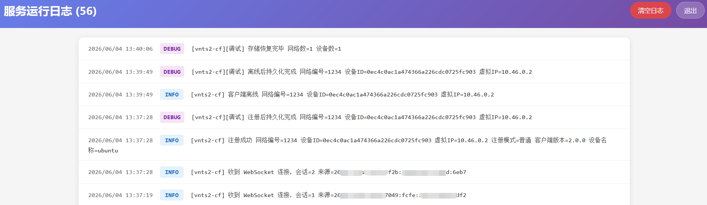
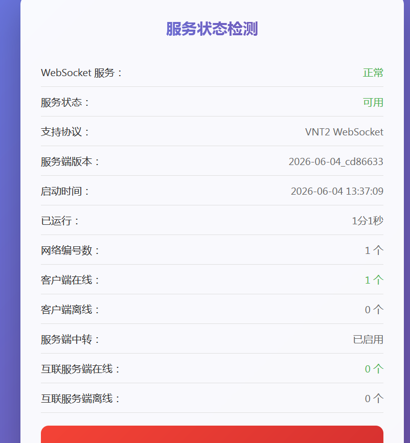
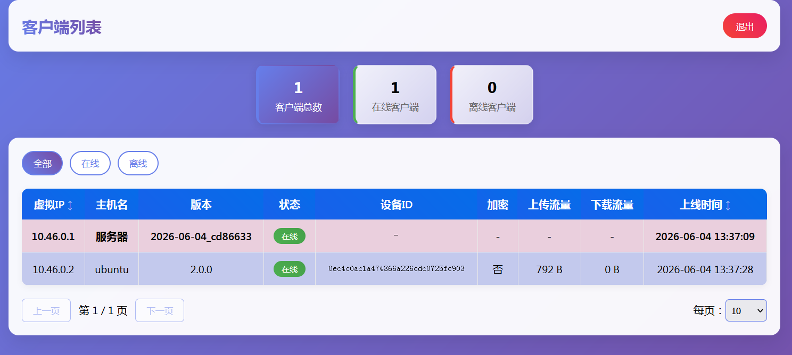
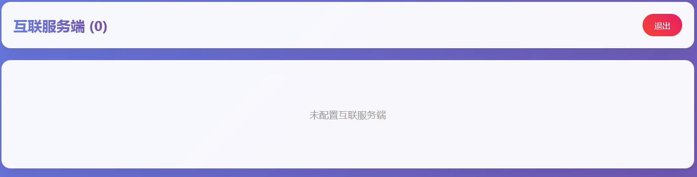

# JavaScript版vnts2的实现，cloudflare worker

#### [VNT2](https://github.com/vnt-dev/vnt/tree/v2) 是一个简便高效的异地组网、内网穿透工具，源项目使用 Rust 实现。本项目使用 Cloudflare Worker + Durable Object 实现了 JavaScript 版本的 WebSocket [VNTS2](https://github.com/vnt-dev/vnts/tree/v2) 服务端，支持网络中继转发与 P2P 打洞信息交换。

#### 本项目由 `Chat-gpt` 联合 `Deepseek` 搓出来，关于本项目不懂的你可以咨询AI 或 <a href="https://deepwiki.com/lmq8267/vnts2-cf"></a>，可以测试反馈或帮忙修复优化！

## 目录

- [UI预览](#ui预览)
- [项目关系](#项目关系)
- [功能对比](#功能对比)
- [必须使用 WSS 连接](#必须使用-wss-连接)
  - [IPv6 DNS 解析问题](#ipv6-dns-解析问题)
- [已实现功能](#已实现功能)
- [页面预览](#页面预览)
  - [/test — 服务状态](#test--服务状态)
  - [/room — 房间状态](#room--房间状态需认证)
  - [/log — 操作日志](#log--操作日志需密码)
  - [/peer — 互联服务端](#peer--互联服务端需令牌)
- [与 Rust vnts2 的差异](#与-rust-vnts2-的差异)
- [Cloudflare 部署](#cloudflare-部署)
- [vnt2 客户端示例](#vnt2-客户端示例)
- [本地 Docker 测试](#本地-docker-测试)
- [基础配置](#基础配置)
  - [配置对照](#配置对照)
  - [Worker 扩展参数](#worker-扩展参数)
- [稳定性和错误处理](#稳定性和错误处理)
- [开发命令](#开发命令)

## UI预览

1. `https://你的CF域名/log`  日志入口，正常使用请勿开启日志，避免消耗额度



2. `https://你的CF域名/test` 健康监测入口，查看部署的服务是否正常



3. `https://你的CF域名/room` 组网房间入口，查看当前网络编号的组网设备状态



4. `https://你的CF域名/peer` 互联服务端入口，查看当前服务端的其他互联服务端状态，建议使用两个CF帐号开启互联，不能与rust vnts2互联



## 项目关系

| 项目 | 类型 | 说明 |
|---|---|---|
| [vnt2](https://github.com/vnt-dev/vnt/tree/v2) | 客户端 CLI | 组网客户端，支持 TCP/TLS、QUIC、WSS 连接服务端 |
| [vnts2](https://github.com/vnt-dev/vnts/tree/v2) | 服务端 | Rust 版服务端，支持 TCP/TLS、QUIC、WSS，可自建 |
| **vnts2-cf** 本项目 | 服务端 (CF) | Cloudflare Workers 版服务端，只支持 WSS 客户端入口 |

`vnt2` 客户端 → WSS → `vnts2-cf`（Cloudflare Workers）

> 本项目仅供学习交流和兼容性测试使用。请勿用于非法用途。

## 功能对比

| 功能 | vnts2 (Rust) | vnts2-cf | 说明 |
|---|---|---|---|
| **监听 TCP** | ✅ | ❌ | Worker 不能监听裸 TCP |
| **监听 QUIC** | ✅ | ❌ | Worker 不能监听 UDP/QUIC |
| **监听 WSS** | ✅ | ✅ | Worker 天然支持 HTTPS+WSS |
| **客户端注册** | ✅ | ✅ | 支持普通/预注册模式 |
| **IP 分配** | ✅ | ✅ | 网段由首个客户端 `--ip` 推导 |
| **租约清理** | ✅ | ✅ | 离线超时自动释放 IP |
| **P2P 打洞** | ✅ | ✅ | 服务端协调打洞 |
| **TURN 中转** | ✅ | ✅ | 服务端中转数据 |
| **P2P 专用** | ✅ | ✅ | `DISABLE_RELAY` 禁止中转 |
| **网关 Ping** | ✅ | ✅ | 客户端延迟检测 |
| **客户端列表** | ✅ | ✅ | `vnt2_ctrl clients` RPC |
| **服务端互联** | ✅ (QUIC) | ✅ (HTTPS) | 实现不同服务端互通 |
| **Web 管理页** | ✅ (内置) | ✅ (Worker 页面) | `/test`、`/room`、`/log`、`/peer` |
| **持久化** | ✅ (SQLite) | ✅ (DO Storage) | 设备和 IP 持久化 |
| **操作日志** | ✅ | ✅ | 持久化日志页面 |
| **日志密码保护** | ✅ | ✅ | 未配置不记录日志 |
| **自定义网关 IP** | ✅ | ✅ | `GATEWAY` 环境变量 |
| **自定义节点名** | ✅ | ✅ | `GATEWAY_NAME` 环境变量 |
| **网络编号限制** | ✅ | ✅ | `NETWORKS` 白名单 |
| **仅 WSS 客户端** | 多协议 | 仅 WSS | 客户端必须用 `-wss` |

## 必须使用 WSS 连接

由于 Cloudflare Workers 只接受 HTTPS/WSS 流量，`vnt2` 客户端连接时必须指定 `-wss` 协议和 `:443` 端口：

```bash
sudo ./vnt2_cli -s wss://你的域名:443 -n 你的网络编号
```

不支持的连接方式：
```
❌ ./vnt2_cli -s 你的域名:443 -n 你的网络编号
❌ ./vnt2_cli -s wss://你的域名 -n 你的网络编号
```

### IPv6 DNS 解析问题

如果域名同时解析到 IPv4 和 IPv6 地址，但客户端所在环境没有 IPv6 网络，连接可能失败或超时。建议：

- 写进本机host指定ipv4地址

## 已实现功能

- `vnt2` WSS 客户端注册。
- `vnts2` 注册/控制 protobuf。
- `vnts2` 16 字节数据包头。
- 普通注册和多服务端预注册确认。
- 客户端 IP 分配、租约保留、离线清理。
- 网关 Ping/Pong、客户端 IP 推送。
- `vnt2_ctrl clients` RPC 客户端列表。
- 服务端网关节点在 `vnt2_ctrl clients` 中作为显示项出现。
- TURN、QUIC、广播、选择性广播中转。
- 仅 P2P 模式，禁止服务端中转。
- `/test`、`/room`、`/log`、`/peer` 中文管理页面。
- 基于 `ServerMessage` protobuf 的 Worker 服务端互联。
- 操作日志持久化到 DO Storage（受 `LOG_PASSWORD` 控制）。
- Docker 端到端测试脚本。

## 页面预览

### `/test` — 服务状态

```
┌──────────────────────────────────────────────────┐
│              vnts2-cf 服务状态                     │
├──────────────────────────────────────────────────┤
│  WebSocket 服务：正常                              │
│  服务版本：2026-06-04_d20e0cc                     │
│  启动时间：2026-06-04 18:30:00                    │
│  已运行：1天2小时30分15秒                          │
│  支持协议：VNT2 WebSocket                         │
│  服务状态：可用                                   │
│  网络编号数：2                                    │
│  服务端中转：已启用                                │
│  互联服务端在线：1 个                              │
│  互联服务端离线：0 个                              │
│  客户端在线：5 个                                  │
│  客户端离线：2 个                                  │
├──────────────────────────────────────────────────┤
│           ┌──────────────┐                       │
│           │   12ms       │   ← 延迟自动检测       │
│           │  连接良好    │                       │
│           └──────────────┘                       │
│           [停止自动检测延迟]                      │
└──────────────────────────────────────────────────┘
```

公开访问，无认证。JSON 格式：`/test?format=json`

### `/room` — 房间状态（需认证）

```
┌──────────────────────────────────────────────────────────────┐
│  客户端列表                                       [退出]     │
├──────────────────────────────────────────────────────────────┤
│  [5]              [3]              [2]                      │
│  客户端总数       在线客户端       离线客户端                  │
├──────────────────────────────────────────────────────────────┤
│  [全部]  [在线]  [离线]                                       │
├─────────┬────────┬──────┬──────┬────────┬────┬────┬────┬─────┤
│ 虚拟IP↕ │ 主机名  │ 版本  │ 状态  │ 设备ID │加密│上传│下载│上线 │
├─────────┼────────┼──────┼──────┼────────┼────┼────┼────┼─────┤
│10.46.0.1│服务器   │ v... │ 🟢在线│   -    │ -  │ -  │ -  │18:30│
│10.46.0.2│设备A   │ 2.0  │ 🟢在线│ abc123 │ 是 │1MB │2MB │20:30│
│10.46.0.3│设备B   │ 2.0  │ 🔴离线│ def456 │ 否 │5KB │1MB │19:00│
│10.46.0.5│互联     │  -   │ 🟢在线│   -    │ -  │ -  │ -  │  -  │
├─────────┴────────┴──────┴──────┴────────┴────┴────┴────┴─────┤
│ 第 1 / 1 页             [上一页] [下一页]  每页：[10 ▾]       │
└──────────────────────────────────────────────────────────────┘
```

认证方式：`/room?network=网络编号&gateway=网关IP`

- **网关行**（紫色背景）：服务端节点，上线时间为服务端启动时间
- **客户端行**（紫蓝交替）：本机连接的设备，设备ID、加密、流量完整显示
- **互联行**（绿色背景）：其他服务端上的设备，仅显示虚拟IP和状态
- 虚拟IP、上线时间支持正反序排列
- 网关始终在列表第一行

JSON 格式：`/room?format=json&network=xxx&gateway=xxx`

认证成功后写入 cookie，后续可直接访问 `/room`。

### `/log` — 操作日志（需密码）

```
┌──────────────────────────────────────────────────────────────┐
│  服务运行日志 (128)                          [清空日志] [退出] │
├──────────────────────────────────────────────────────────────┤
│  2026-06-04 20:30:15  INFO  注册成功 网络=1234 ...           │
│  2026-06-04 20:28:10  DEBUG 收到 WebSocket 连接 ...          │
│  2026-06-04 20:25:00  ERROR 请求处理失败：...                  │
│  2026-06-04 20:20:33  INFO  客户端离线 ...                    │
│  ...                                                         │
└──────────────────────────────────────────────────────────────┘
                                                        [🔝]
```

认证方式：`/log?password=xxx`

- 日志包含时间（北京时间）、级别（彩色标签）、消息内容
- 保留最近 500 条，持久化到 DO Storage
- `LOG_PASSWORD` 留空时 `/log` 不开放且不记录日志
- 清空日志操作不可恢复
- 登录页有**记住密码**勾选

### `/peer` — 互联服务端（需令牌）

```
┌──────────────────────────────────────────────────────┐
│  互联服务端 (2)                             [退出]    │
├──────────────────────────────────────────────────────┤
│  地址                         │ 状态                  │
├───────────────────────────────┼──────────────────────┤
│  https://server-b.workers.dev│ 🟢 在线               │
│  https://server-c.workers.dev│ 🔴 离线               │
└──────────────────────────────────────────────────────┘
```

认证方式：`/peer?token=互联令牌`

- 仅配置 `SERVER_TOKEN` 后开放
- 状态基于上次定时拉取是否成功，15 秒超时标记离线
- 登录页有**记住令牌**勾选

## 与 Rust vnts2 的差异

`vnts2-cf` 和 Rust `vnts2` 的客户端协议保持兼容，但传输能力受 Cloudflare Workers 限制：

- 客户端入口：实际使用 WSS。
- 不能监听原生 TCP/QUIC。
- 不能直接接入 Rust `vnts2` 的 QUIC peer 互联通道。
- Worker 之间互联使用 HTTPS `/peer/message` 承载 `vnts2/proto/server_message.proto` 的 `ServerMessage` protobuf。
- `forward_data.data` 仍是原始 vnts2 16 字节包头数据。

因此，`vnts2-cf` 与 `vnts2-cf` 之间的互联业务效果和 Rust `vnts2` 互联一致：同步在线客户端、选择 peer 路由、转发原始数据包、避免互联循环。若要与 Rust `vnts2` 直接互联，需要额外桥接 Rust QUIC peer 和 Worker HTTPS peer。

## Cloudflare 部署

1. Fork 本仓库。
2. 登录[Cloudflare Dashboard](https://dash.cloudflare.com)
3. 进入 Workers & Pages → 创建应用程序（Create Application） →  Workers →  链接到github仓库 选择你刚刚fork的仓库，直接部署
4. 绑定自定义域名：打开 Worker 设置 → Triggers(域和路由) → 添加 → Custom Domains(自定义域名)，添加你的域名并保存。
5.vnt2客户端采用 `-s wss://域名:443` 连接

## vnt2 客户端示例

```bash
# 普通连接
sudo ./vnt2_cli -s wss://你的域名:443 -n 你的网络编号 --cert-mode skip

# 强制 IPv4（避免 IPv6 超时）
sudo ./vnt2_cli -4 -s wss://你的域名:443 -n 你的网络编号 --cert-mode skip

# 指定虚拟 IP
sudo ./vnt2_cli -s wss://你的域名:443 -n 你的网络编号 --ip 10.88.0.2 --cert-mode skip

# 控制端口
sudo ./vnt2_cli -s wss://你的域名:443 -n 你的网络编号 --cert-mode skip --ctrl-port 11233
./vnt2_ctrl -p 11233 clients
./vnt2_ctrl -p 11233 route

# 子网输入/输出
sudo ./vnt2_cli -s wss://你的域名:443 -n 你的网络编号 --ip 10.88.0.2 --cert-mode skip -i 172.30.2.0/24,10.88.0.2
sudo ./vnt2_cli -s wss://你的域名:443 -n 你的网络编号t --ip 10.88.0.3 --cert-mode skip -o 172.30.2.0/24
```

## 本地 Docker 测试

单服务端启动：

```bash
cd vnts2-cf
sudo docker build -t vnts2-cf .
sudo docker run --rm -it -p 8787:8787 \
  -e LOCAL_PROTOCOL=http-wss-proxy \
  -v "$(pwd)":/app -v /app/node_modules \
  vnts2-cf
```

客户端连接：

```bash
sudo ./vnt2_cli -s wss://127.0.0.1:8787 -n 你的网络编号 --cert-mode skip
```

Docker 端到端测试：

```bash
cd vnts2-cf
printf '管理员密码\n' | npm run docker:e2e
```

## 基础配置

编辑 `wrangler.toml` 的 `[vars]`，详见文件内注释说明。

### 配置对照

Rust `vnts2` 配置字段和 `vnts2-cf` 环境变量对照：

| Rust vnts2 | vnts2-cf | 说明 |
| --- | --- | --- |
| `tcp_bind` | 不支持 | Worker 不能监听裸 TCP |
| `quic_bind` | 不支持 | Worker 不能监听 QUIC |
| `ws_bind` | 不支持 | Worker/Wrangler 入口由平台决定 |
| `cert` / `key` | 不支持 | TLS 由 Cloudflare 平台处理 |
| `white_list` | 不支持 | `NETWORKS` 只限制网络编号 |
| `lease_duration` | `LEASE_DURATION` | 离线租约秒数 |
| `web_bind` | 不支持 | Worker 用 `/test`、`/room`、`/log`、`/peer` |
| `username` / `password` | 不支持 | 页面使用 network+gateway 或 `LOG_PASSWORD` |
| `persistence` | 固定启用 | DO Storage 固定可用 |
| `server_quic_bind` | 不支持 | Worker 不能监听 QUIC peer |
| `peer_servers` | `PEER_SERVERS` | Worker peer 地址 |
| `server_token` | `SERVER_TOKEN` | peer 共享令牌 |
| `custom_nets` | 不支持 | 网段由首个客户端 `--ip` 推导 |
| `network_secrets` | 不支持 | 客户端密码不参与服务端校验 |

### Worker 扩展参数

| 参数 | 默认值 | 说明 |
|---|---|---|
| `NETWORKS` | 空（允许所有） | 允许的网络编号白名单 |
| `GATEWAY` | `10.46.0.1` | 默认网关 IP |
| `GATEWAY_NAME` | `服务器` | 页面中服务端节点名称 |
| `LOCATION_HINT` | `apac` | DO 位置提示，降低延迟 |
| `MAINTENANCE_INTERVAL` | `15` | 维护周期（秒） |
| `DISABLE_RELAY` | `0` | 禁止服务端中转 |
| `LOG_LEVEL` | `info` | 日志级别 |
| `LOG_PASSWORD` | 空 | 日志页面密码，未配置不记录日志 |
| `PEER_SERVERS` | 空 | 互联服务端地址列表 |
| `SERVER_TOKEN` | 空 | 互联共享令牌 |
| `SERVER_VERSION` | 自动生成 | 版本号（部署时自动生成） |

## 稳定性和错误处理

- HTTP、peer 和 Durable Object 请求入口都有异常边界，内部错误会返回错误响应并记录日志。
- 单个客户端的畸形消息、发送失败或连接错误只关闭对应会话，不影响其他客户端。
- alarm 维护任务失败会记录错误，并继续尝试调度下一次维护。
- 损坏的持久化网络或设备记录会被跳过，不会阻止 Durable Object 初始化。
- WebSocket 和 peer 单条输入消息最大为 1 MiB；protobuf 输出最大为 2 MiB。
- 单个 Durable Object 最多保留 1024 个会话、1024 个网络和 4096 个设备记录。
- 租约过期并且没有互联客户端的空网络会自动删除。

## 开发命令

```bash
npm test          # 运行测试
npm run gen-version # 生成版本号
npm run dev       # 本地开发
npm run deploy    # 部署到 Cloudflare
npm run tail      # 查看日志
npm run docker:e2e # Docker 端到端测试
```

## 免责声明

本项目仅供学习交流使用。使用本项目代码所产生的任何后果，均由使用者自行承担。作者不对使用本项目代码可能引起的任何直接或间接损害负责。
